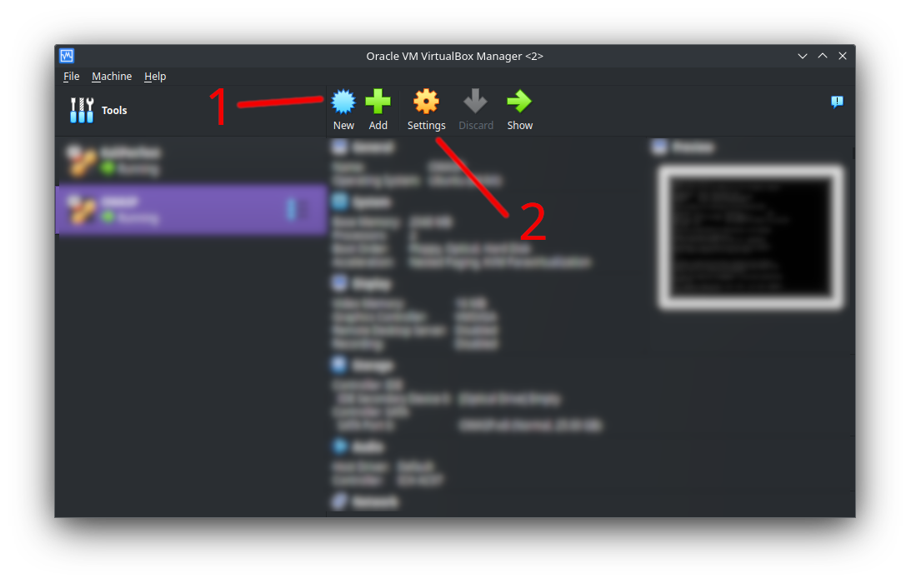
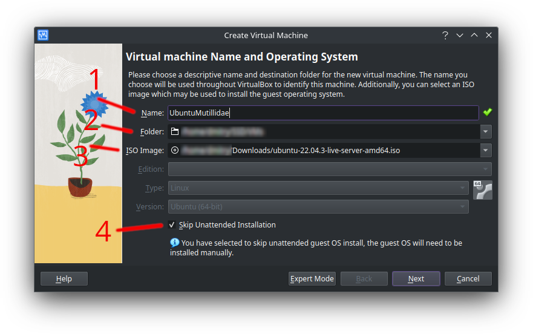
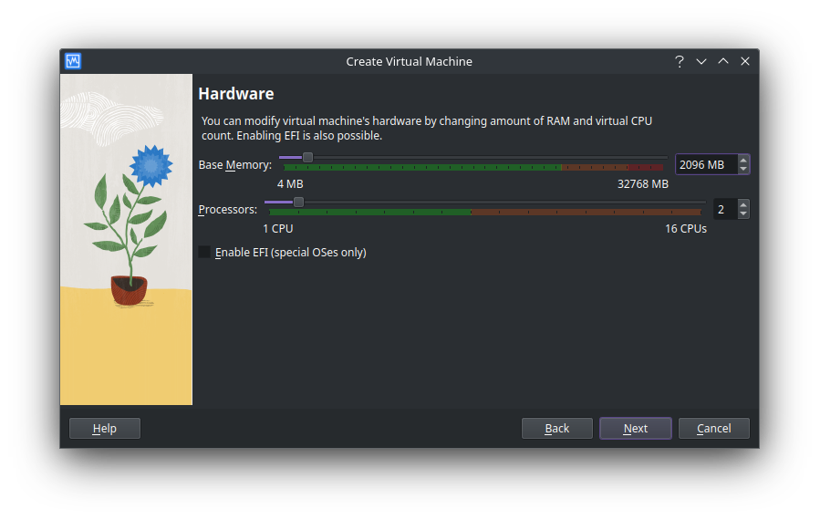
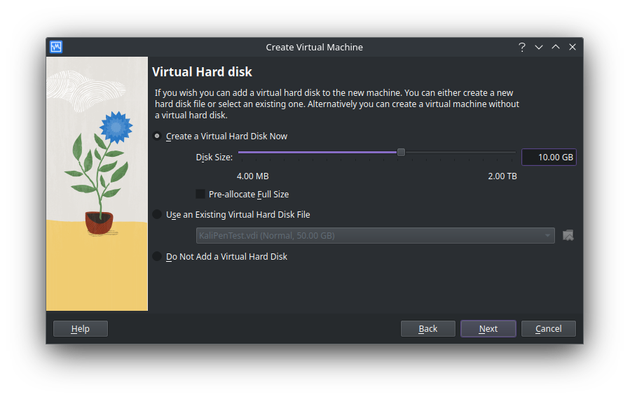
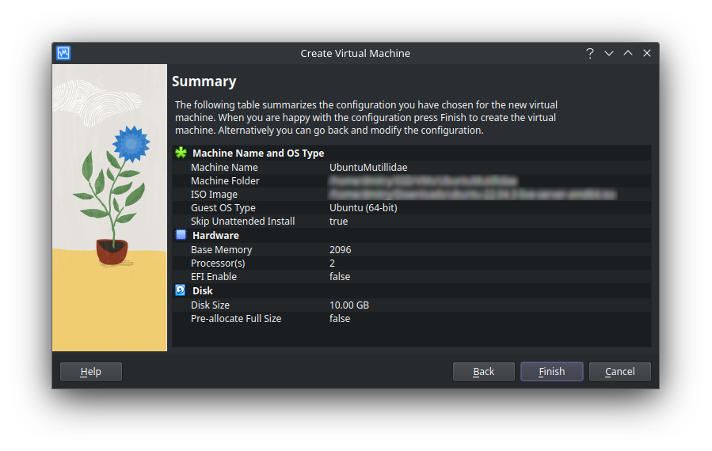
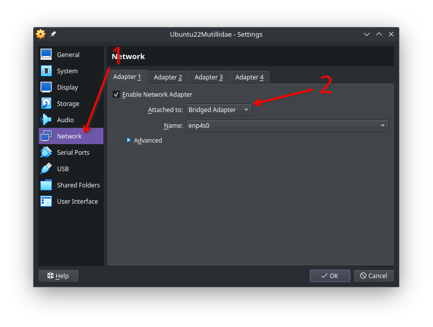

# Installation

I will describe almost full installation, starting with installing VirtualBox and creating and configuring VM, ending with accessing the working website.<br>
<br>
I will use Ubuntu 24.04.3 LTS as the OS, Apache2 as web-server, PHP 8.2 and MariaDB as database server.<br>
<br>
This instruction doesn't pretend to be full and/or fully accurate. I just didn't find really working text description of the installation and decided to make my own.
<br>
My host OS is EndeavourOS. If you use Windows, the only difference is in installing VirtualBox. You can find Windows instructions on web and/or use any other hypervisor.<br>
:warning: Be sure that virtualization is enabled in your BIOS settings! On AMD CPUs it is named **AMD-V** and on Intel CPUs it is named **Intel VT** (Intel Virtualization Technology). In case you don't want or can't enable virtualization on your host, you could **proceed with your host OS**, but this way **should be avoided in any way!!!. I'm not responsible for your device or OS.**

## Installing the VirtualBox

In case you use Arch Linux too, the VirtualBox should be available via package manager. Just use `sudo pacman -S virtualbox virtualbox-guest-iso`.<br>
I'm not sure about other distros, so you can visit [the official VirtualBox site](https://www.virtualbox.org/wiki/Linux_Downloads) and download the required package. Then install it with `sudo dpkg -i downloaded_file.deb`, `sudo dnf install downloaded_file.rpm` or with another package manager from your system.

## Creating the VM

- Go to the [Old Ubuntu Releases](https://old-releases.ubuntu.com/releases/) page and press **Ubuntu 22.04.3 LTS (Jammy Jellyfish)**;
- Find and click **ubuntu-22.04.3-live-server-amd64.iso** to download the installation iso file. It should be at the bottom of the page. Or you can just press [this link.](https://old-releases.ubuntu.com/releases/jammy/ubuntu-22.04.3-live-server-amd64.iso);
- Start VirtualBox. We would need only two buttons: **New (1)** and **Settings (2)**;



- Press **New (1)** button. The new window would appear.



1. Enter any suitable name for the new VM. It's up to you;
2. Choose the folder where the subfolder with all required files for this VM will be created. Assume, that this path is "/home/user/VMs" and VM's name is "Test VM", all VM's files would be placed in "/home/user/VMs/Test VM" folder;
3. Choose downloaded previously iso installation image;
4. Check this box to disable automatic OS installation to configure it manually. Then press **Next** button.



- Configure RAM and CPUs availbale for VM. For our puproses it would be enough to set 1024MB RAM and 1 CPU. Press **Next**.



- Specify the VM's disk size. 10GB would be enough in our case. By default, the disk image's size would be minimal and would be expanding as needed. To allocate full size from the beginning, check the corresponding checkbox. Then press **Next**.



- Here you could check all the configuration parameters. If everything is fine, then press the **Finish** button and wait a bit, while VM is creating. It would be enough fast;
- Then press the **Settings** button from the first screenshot. The VM's configuration window would appear.



- Open **Network** section and change **Attached to** to **Bridged adapter**. In that mode your VM would got own IP address in your subnet, so any other hosts in subnet could access it. It's the simplest way. You can check the [VirtualBox documentation](https://www.virtualbox.org/manual/ch06.html) to learn more about network modes in VirtualBox;
- After changing network settings, press the **Ok** button;
- Launch the VM via the **Start** button and wait until the initial OS configuration window appears.

I wouldn't describe the OS installation, because it's enough simple and there are plenty of instructions on the web. Nothing special should be configured during installation, but I recommend enabling **ssh server** checkbox;

## Services installation

:warning: **Take attention, that all following configurations are absolutely insecure and shouldn't be used in any production environment!**
We need to install a database server (MariaDB), PHP and web-server (Apache).

### MariaDB installation

- Run `sudo apt install -y mariadb-server` and wait until installation is completed;
- Enter the database server, entering `sudo mysql`;
	- Set the password for root user, using `ALTER USER 'root'@'localhost' IDENTIFIED BY 'my_password';`;
	- Create database, entering `CREATE DATABASE mutillidae;`;
	- Exit from database management with `quit`;

### Apache installation

- Install Apache web-server with `sudo apt install -y apache2` command;

### PHP installation

- Enable PHP PPA repository with `sudo add-apt-repository ppa:ondrej/php`;
- By default, php8.3 is installed in Ubuntu 22.04.3. Check installation with `php -v` command;
	- If it's installed, then install required packages with `sudo apt install libapache2-mod-php php8.3-{cli,fpm,xml,curl,mbstring,intl,mysql}`;
	- If it isn't installed, then install PHP and required modules with `sudo apt update && sudo apt install -y php8.2 libapache2-mod-php php8.2-{cli,fpm,xml,curl,mbstring,intl,mysql}`

### Mutillidae installation

- Now `cd /var/www` or into any other folder, which web-server could access and clone the mutillidae repo from github with `sudo git clone https://github.com/webpwnized/mutillidae.git`;
- Give permissions to web-server for this folder with `sudo chown -R www-data: /var/www/mutillidae && sudo chmod -R 775 /var/www/mutillidae`;
- Edit `sudo vi /var/www/mutillidae/src/include/database-config.inc` and change only **DB_PASSWORD** to those, which you set for root user in MariaDB. Then save and exit with **Shift+:** and **wq**;

Now we need to configure Apache web-server to serve this directory with service in it. Follow next steps:

- Run `cd /etc/apache2` to cd into web-server config directory;
- Run `sudo a2dissite 000-default && sudo a2enmod rewrite` to disable default the welcome page and enable rewrite mode;
- Run `sudo vi ./sites-available/mutillidae.conf` and paste here the following config:

```apacheconf
<VirtualHost *:80>
	ServerName mutillidae.localhost
	ServerAlias www.mutillidae.localhost mutillidae
	DocumentRoot /var/www/mutillidae/src
	Include conf/headers.conf
	Include conf/error-pages.conf

	<IfModule dir_module>
    		DirectoryIndex index.php
	</IfModule>

	<Directory /var/www/mutillidae/src>
		AllowOverride All
		Options +Indexes +FollowSymLinks +MultiViews
		Require all granted
	</Directory>

	ErrorLog ${APACHE_LOG_DIR}/mutillidae-error.log
	CustomLog ${APACHE_LOG_DIR}/mutillidae-access.log combined
</VirtualHost>
```

- Then run `sudo cp -r /var/www/mutillidae/src/configuration/apache-configuration/conf /etc/apache2`;
- Run `sudo bash -c 'cat /var/www/mutillidae/src/configuration/hosts-file/hosts > /etc/hosts'`
- Run `sudo systemctl restart apache2 php8.3-fpm`.

Now you can try to access this server from yout browser, just entering it's IP, which could be found with `ip -brief a`, for example.
